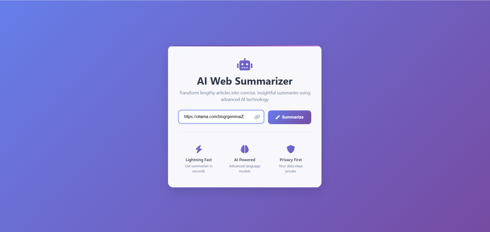
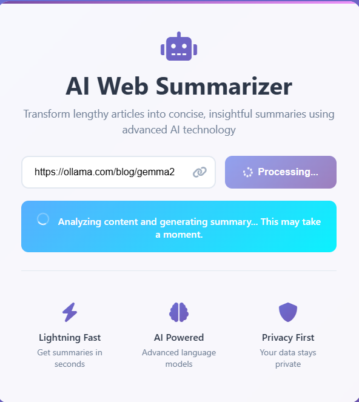
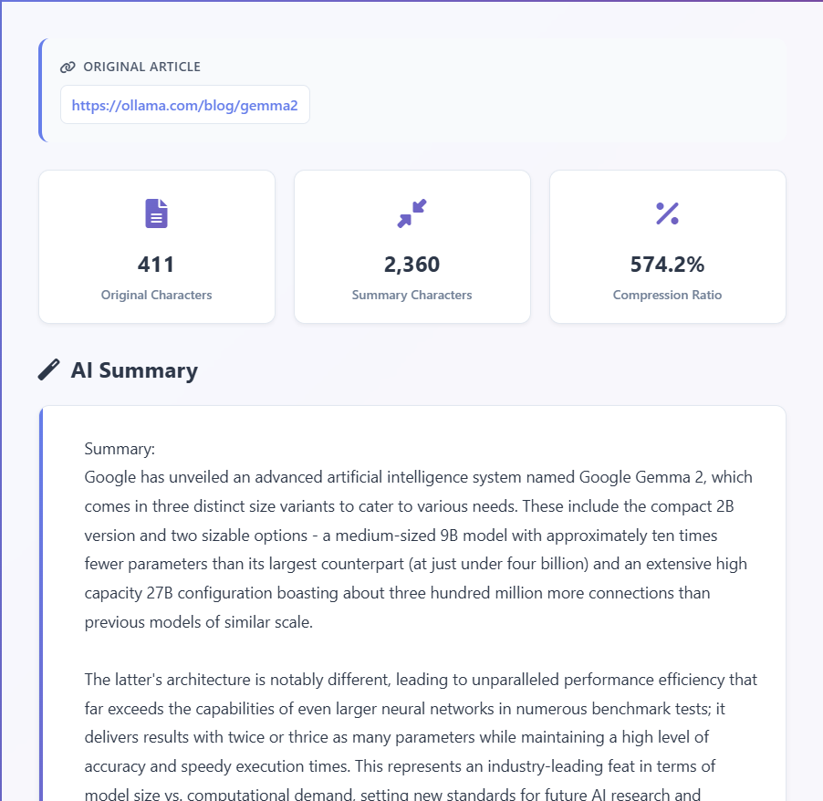

<h1 align="center">AI Web Summarizer</h1>

<p align="center">
  A sleek, modern web application that transforms any article into a concise, insightful summary using a locally-running LLM. Built with Python, Flask, and Ollama for 100% private, offline-capable AI processing.
</p>

<p align="center">
  <a href="#features"><strong>Features</strong></a> ·
  <a href="#live-walkthrough"><strong>Walkthrough</strong></a> ·
  <a href="#tech-stack"><strong>Tech Stack</strong></a> ·
  <a href="#getting-started"><strong>Getting Started</strong></a> ·
  <a href="#roadmap"><strong>Roadmap</strong></a>
</p>

<p align="center">
  
  
  
  
</p>

---

## ✨ Features

-   **🔒 100% Private:** All processing happens on your local machine. Your data, browsing habits, and queries never leave your computer.
-   **🚀 Modern & Responsive UI:** A clean, intuitive interface built to provide a seamless user experience on any device.
-   **📊 Insightful Analysis:** Automatically calculates and displays the original vs. summary character count and the overall compression ratio.
-   **⚡ Real-time Feedback:** The UI provides clear "Processing" and "Analyzing" states, so you're never left wondering what's happening.
-   **🚫 No API Keys, No Costs:** Runs entirely offline (after model download). Free from reliance on third-party services and subscriptions.
-   **🔧 Extensible Core:** Easily configured to use any model available in your local Ollama library (e.g., `llama3`, `mistral`).

---

## 🚀 Live Walkthrough

### 1. Submit an Article
Paste the URL of an article into the input field. The sleek UI makes it simple to get started.

<p align="center">
  
</p>

### 2. Real-time Processing
The application provides clear visual feedback while it fetches the content and the local AI model generates the summary.

<p align="center">
  
</p>

### 3. View Your Summary & Analysis
In just a few moments, receive a concise summary along with insightful metrics about the content compression.

<p align="center">
  
</p>

---

## 🛠️ Tech Stack

This project leverages a modern, efficient stack for local AI development:

| Category      | Technology                                                                                                    |
| ------------- | ------------------------------------------------------------------------------------------------------------- |
| **Backend**   | [**Python**](https://www.python.org/), [**Flask**](https://flask.palletsprojects.com/)                           |
| **AI**        | [**Ollama**](https://ollama.com/) (for local LLM inference), [**phi3:mini**](https://ollama.com/library/phi3) (model) |
| **Web Scraping**| [**Requests**](https://pypi.org/project/requests/), [**BeautifulSoup4**](https://pypi.org/project/beautifulsoup4/) |
| **Frontend**  | HTML5, CSS3, Vanilla JavaScript                                                                               |

---

## 🏁 Getting Started

Follow these steps to get the project running on your local machine.

### Prerequisites

-   **Git:** To clone the repository.
-   **Python 3.8+:** To run the Flask application.
-   **Ollama:** You must have the [Ollama application](https://ollama.com/) installed and **running**.

### Installation

1.  **Clone the Repository**
    ```bash
    git clone https://github.com/Devdevel03/WebScraping-using-phi-3mini.git
    cd WebScraping-using-phi-3mini
    ```

2.  **Pull the Ollama Model**
    This project is configured to use `phi3:mini`. Pull it from the Ollama library:
    ```bash
    ollama pull phi3:mini
    ```

3.  **Set Up a Virtual Environment & Install Dependencies**
    Using a virtual environment is highly recommended.
    ```bash
    # Create a virtual environment
    python -m venv venv

    # Activate it
    # On Windows:
    .\venv\Scripts\activate
    # On macOS/Linux:
    # source venv/bin/activate

    # Install the required packages
    pip install -r requirements.txt
    ```

### Running the Application

With Ollama running in the background and your virtual environment activated, start the Flask server:

```bash
python app.py
